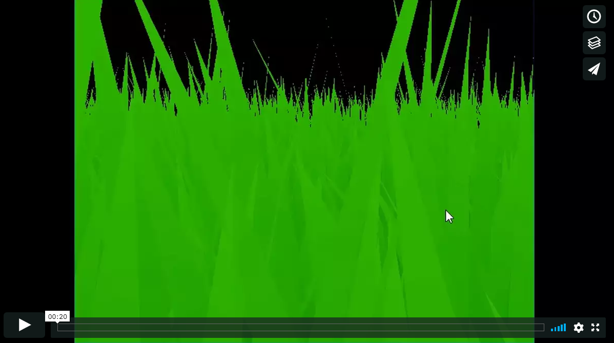
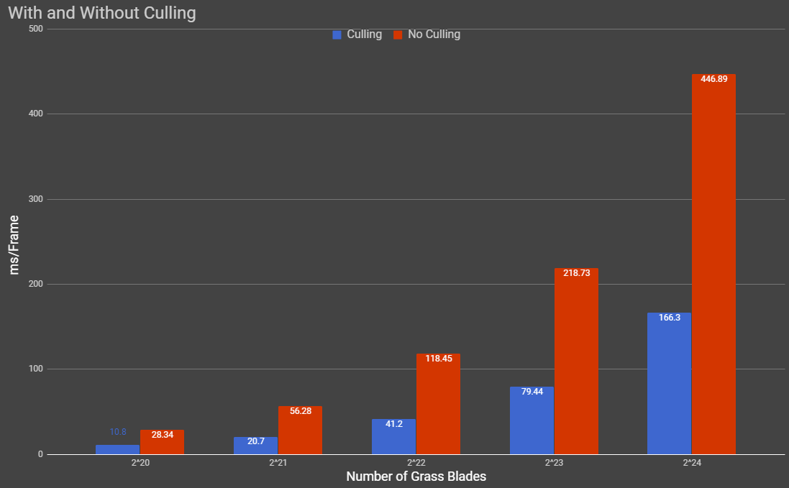
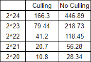
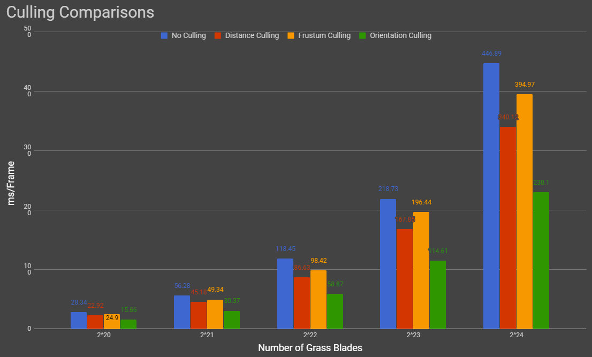
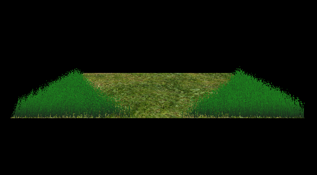
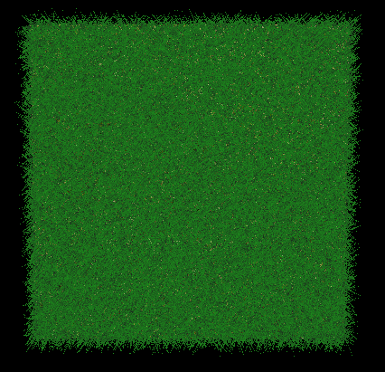

Vulkan Grass Tesselation
========================

**University of Pennsylvania, CIS 565: GPU Programming and Architecture, Project 6**

* Aman Sachan
* Tested on: Windows 10, i7-7700HQ @ 2.8GHz 32GB, GTX 1070(laptop GPU) 8074MB (Personal Machine: Customized MSI GT62VR 7RE)

## Demo Video

## OverView

This project implements a grass simulator and renderer using Vulkan. Each grass blade is represented by a quadratic Bezier curve, and physics calculations are performed on these control points in a compute shader. Since rendering every grass blade is computationally expensive, grass blade that do not contribute to a frame are culled in the computer shader. Visible bezier representaions of grass blades are sent to a grass graphics pipeline where the Bezier control points are transofmred, geometry is created in tesselations shaders, and the grass is shaded in the fragment shader.

The project follows [Responsive Real-Time Grass Rendering for General 3D Scenes](https://www.cg.tuwien.ac.at/research/publications/2017/JAHRMANN-2017-RRTG/JAHRMANN-2017-RRTG-draft.pdf) very closely

## Grass Simulation

A grass blade is represented by a Bezier curve where the first control point is fixed on the plane, and the physics calculations are performed on the third control point. Along with the three control points, a blade is also defined by an up vector and scalar height, orientation, width, and stiffness coefficient.

All of the blade data is packed into 4 `vec4`s. The scalar values are packed into the fourth component of the control points and the up vector.  

| x | y | z | w |
| ---- | ---- | ---- | ----------- |
| v0.x | v0.y | v0.z | orientation |
| v1.x | v1.y | v1.z | height |
| v2.x | v2.y | v2.z | width |
| up.x | up.y | up.z | stiffness |

### Forces per Grass Blade

Forces are first applied to the `v2` control point. Potential errors are corrected in the state validation stage. The total force applied is the sum of the gravity, recovery, and wind forces.  

#### Gravity

Gravitational forces applied to each grass blade is a sum of the environmental gravity and the front gravity, which is the gravity with respect to the front facing direction of the blade - computed using the orientation. 

`environmentalGravity = normalize(D.xyz) * D.w`

`frontGravity = (0.25) * ||environmentalGravity|| * frontFacingDirection`

`g = environmentalGravity + frontGravity`

#### Recovery

The grass blades were modelled to act like springs, i.e in accordance to Hooke's law, which means that there is a force that brings the blade back to equilibrium. This force acts in the direction of the original `v2` position, or `iv2`, and is scaled by the stiffness coefficient. The larger the stiffness coefficient, the more the force pushing the blade back to equilibrium. 

`initial_v2 = v0 + up * height`

`r = (initial_v2 - v2) * stiffness`

#### Wind

Wind can be modelled as any function. A touch of randomness in the function allows every individual blade to look as if it reacts independently to forces. The random function being used in this implementation is:

`vec3 windDirection = normalize(vec3(1, 1, 1));`

`float windStrength = 10.0* rand(v0.xz) * cos(totalTime);`

`float fd = 1.0 - abs(dot(windDirection, normalize(v2 - v0)));`

`float fr = dot(v2 - v0, up) / height;`

`float theta = fd * fr;`

`vec3 wind = windStrength * windDirection * theta;`

### State Validation

Before `v2` can be translated, the new state must first be corrected for errors. First, `v2` must remain above `v0` because the blade cannot intersect the ground plane. In addition, the system insures that each blade always has a slight curvature, and the length of the Bezier curve is not longer than the fixed blade height. 

## Culling

Because simulating thousands upon thousands of grass blades can get computationally expensive we want to cull some of them away. In this project 3 culling techniques were implemented. 

### Orientation culling

Grass blades are very thin, so when the blades are viewed from the side the blades could be rendered such that parts of the blades are smaller than the size of a pixel. This leads to aliasing artifacts. Therefore blades oriented at angles almost perpendicular to the view vector are culled. 

|  |  | 
| ---------------------------------------------- | ---------------------------------------------- |
| 65,536 | 20,546 | 

The above scene is shown at three different viewing angles and all the blades in the scene are facing the same direction. When viewed head on (left), all the blades are rendered, but as the scene rotates, blades are culled based on their orientation with respect to the camera. 

### View-frustum culling

Blades that are outside of the view-frustum should be culled because they will never be rendered on screen. This means we can avoid doing computation for all the grass blades outside of the view-frustum. To determine if a blade is in frame, we compare the visibility of the first and last control points and a weighted midpoint instead of `v1` because `v1` does not lie on the curve.

|  |  
| ------------------------------------------ | ------------------------------------------ |
| Blades Rendered | Blades Rendered | 
| 65,536 | 2,103 | 

As camera zooms in on the scene, more blades move outside of the viewing frustum and less blades are rendered. 

### Distance culling

Similar to orientation culling, grass blades at large distances from the camera can be smaller than the size of a pixel and thus can lead to aliasing artifacts. To solve this, we reduce grass density the further we get from the camera.

|  |  | 
| ------------------------------------------- | ------------------------------------------- |
| Blades Rendered | Blades Rendered | 
| 61,239 | 36,321 | 

When the camera is zoomed in, few blades of grass are culled from the maximum number of instances (65,536), but as we zoom out, we can decrease the grass density without sacrificing realism: the right image does not appear less dense than the first two even though it has ~10,000 less blades of grass. The comparison of rendered blade count is restricted to only distance culling, even though in the full pipeline, the first image would also cull outside of the view frustum.   